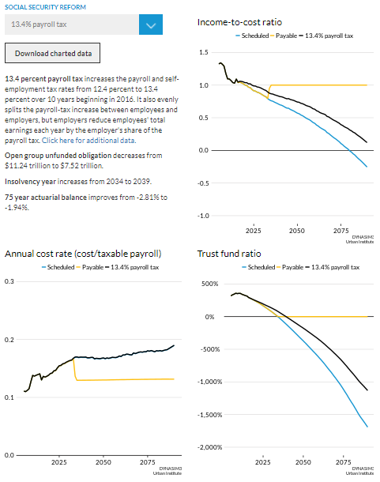

# dynasim-shiny1

Interactive web visualization of DYNASIM projections of combined OASDI trust fund health. [Link!](https://www.urban.org/policy-centers/cross-center-initiatives/program-retirement-policy/projects/dynasim-visualizing-older-americans-future-well-being/fiscal-health-social-security)

## Data

Data source: Urban Institute's Dynamic Simulation of Income Model (DYNASIM), 2017

## Scripts

### get_data.R

This script pulls and cleans data from `TrustFundSummaryBPC.xlsx`. Each page represents a BPC reform option and contains different measures of the financial health of Social Security. This script creates data frames for each measure of financial health which contain vectors for each BPC reform option and then writes those data frames to .csv files which can be found in the data folder. 

### app.R

This script takes the .csv files created in get_data.R and stored in the data folder, and turns them into a two column interactive shiny graphic.  

### themes

The R Shiny graphic is built using the [Urban Institute R theme](https://github.com/UrbanInstitute/urban_R_theme). The theme works better using Mac OSX than Windows so `urban_theme_mac.R` is used when publishing the Shiny graphic and `urban_theme_windows.R` is used for developing edits and new features. 

**Note:** Lines at the top of `app.R` need to be commented out when switching between operating systems. 

### www/

All images and .css go in `www/`

## Built With
* R
* [Shiny](https://shiny.rstudio.com/)

## Authors
* Aaron Williams
* Karen Smith
* Ben Chartoff
* Jerry Ta
* Michael Marazzi
* Dave D'Orio